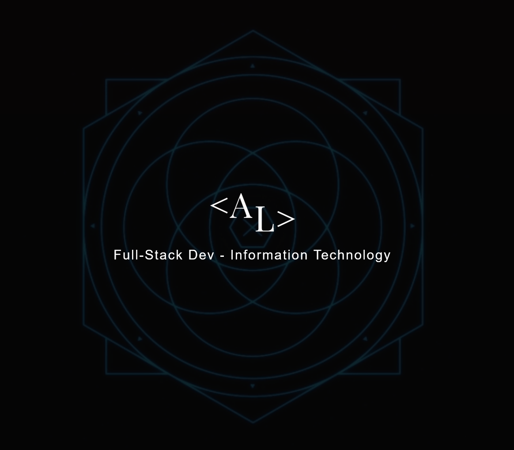

  

<h1 align="center">
  Hi I'm Andy Luo!
</h1>

<!--
**AndiLuo/AndiLuo** is a ✨ _special_ ✨ repository because its `README.md` (this file) appears on your GitHub profile.

Here are some ideas to get you started:

- 🔭 I’m currently working on ...
- 🌱 I’m currently learning ...
- 👯 I’m looking to collaborate on ...
- 🤔 I’m looking for help with ...
- 💬 Ask me about ...
- 📫 How to reach me: ...
- 😄 Pronouns: ...
- ⚡ Fun fact: ...
-->

  <a href="https://github.com/AndiLuo">
  
  

### About Me 😀
I'm a full-stack developer with 2 years experience in this industry so I'm always looking for oppurtunities to learn and expand my development capabilities!

## Things I like to do
- Playing guitar and jamming out 🎸!
- Kayaking 🚣🏼, Hiking 🌲, and other outdoor activities 🌄!
- Game theorycrafting 📊!
- Learning new development skills 😎!

[My Website!(Outdated)](https://andyluo.xyz/)
